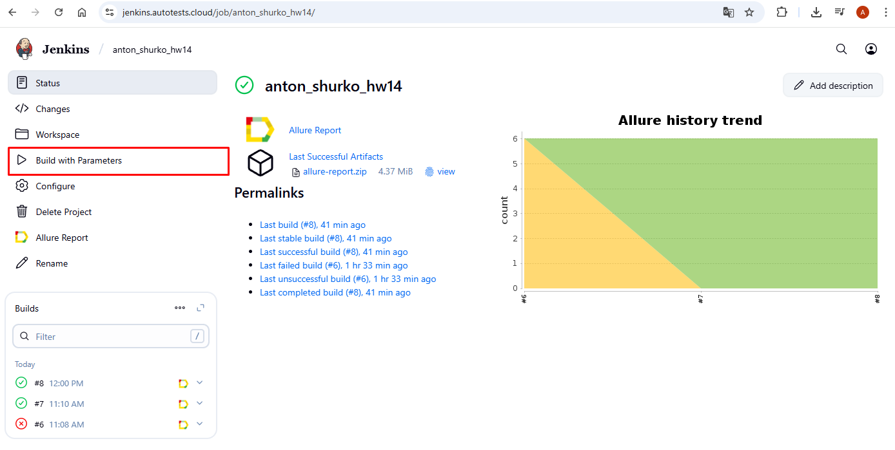
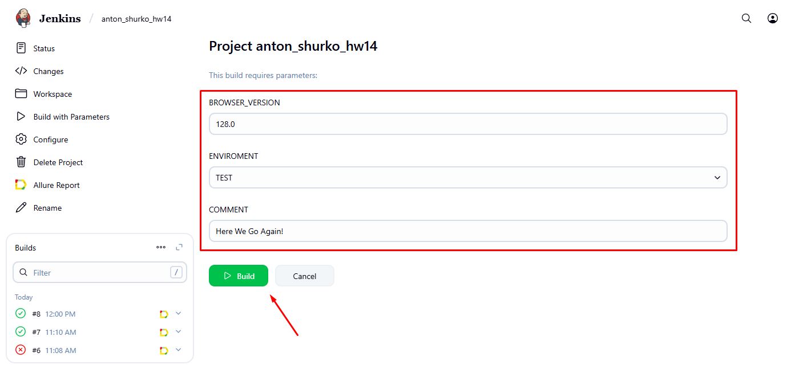
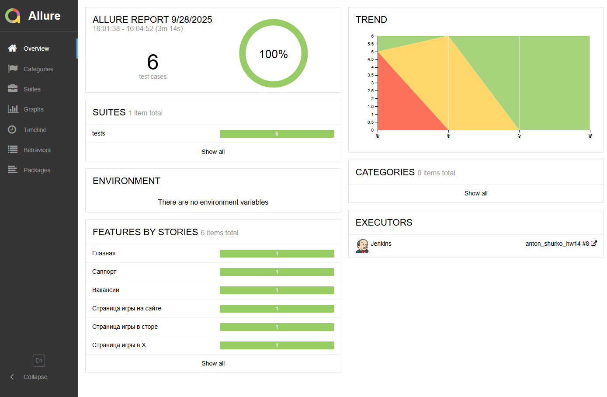
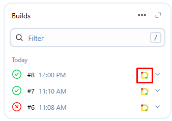
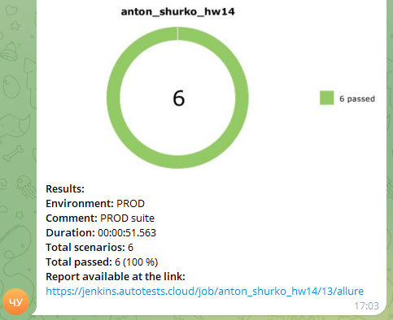

# 🎓 QA.GURU Playrix Project

*Небольшой проект по автоматизации Playrix, базовой проверке нескольких кейсов*
# <code></code>
## О проекте

Этот проект является дипломной работой по курсу QA.GURU и представляет собой фреймворк для автоматизации тестирования веб-сайта ["Playrix"](https://www.playrix.com). В реализации использованы инструменты и библиотеки:

  
  
  
  
  
  
  
  
  
  

##  Запуск тестов локально

1) Клонировать репозиторий: git clone https://github.com/ashurko/qa_guru_python_21_hw14_pre-diploma.git
2) Установить зависимости: pip install -r requirements.txt
3) Запуск тестов с генерацией отчетов Allure: pytest --alluredir=reports/allure-results

##    Создание сборки на удаленном сервере - Jenkins

1) Авторизоваться в Jenkins
2) Перейти в джобу https://jenkins.autotests.cloud/job/anton_shurko_hw14/
3) Для запуска тестов в Jenkins нажать "Build With Parameters"
4) Выбрать необходимые параметры
5) Нажать Run Build

##  Визуализация результатов (Allure Reports и Allure TestOps)

Для просмотра результатов тестового прогона в Allure клик на соответствующую ему иконку

Для просмотра результатов тестового прогона в Allure TestOps кликнув на соответствующую ему иконку в джобе Jenkins

БУДЕТ ДОПОЛНЕНО

БУДЕТ ДОПОЛНЕНО

##  Интеграция с Telegram в Jenkins для автоматической отправки результатов тестового прогона через бота

